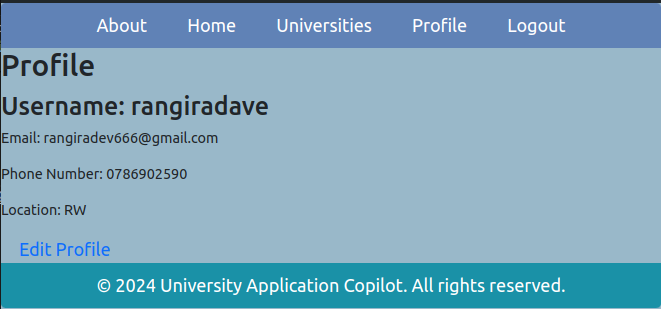

# University Application Copilot

## Introduction

University Application Copilot is a web application designed to assist African students who have completed their high-school studies and are unsure of their next steps. The website aims to simplify the process of university search and help students make informed decisions about the best universities for them.

<em>We believe that with the help of University Application Copilot, African students will have a better chance of finding the right university and pursuing their higher education goals.</em>

- Deployed site: [rangira.tech](rangira.tech)
- Final project blog article: []
- Author(s)
    - [Rangira](github.com/Rangiradave)
    - [Masonga](github.com/Masongaprince222)

## Features

- **University lookup:** Users can search for universities based on various criteria such as location, programs offered, admission requirements, and more.
- **Personalized recommendations:** The application provides personalized recommendations based on the user's academic background, interests, and preferences.
- **Application guidance:** Users can access resources and guidance on the university application process, including tips for writing personal statements, preparing for interviews, and submitting applications.
- **Reviews and ratings:** Students can read reviews and ratings from current and former students to get insights into the quality of education, campus life, and other aspects of different universities.
- **Compare universities:** The website allows users to compare multiple universities side by side, making it easier to evaluate their options.
- **Notifications and reminders:** Users can set up notifications and reminders for important application deadlines, scholarship opportunities, and other relevant events.
- **Community forum:** The platform includes a community forum where students can connect with each other, ask questions, and share experiences related to university applications.

## Installation

To get this project running locally, follow these steps:

```
bash
git clone https://github.com/username/application-copilot.git
cd application-copilot
pip install -r requirements.txt
```

## Usage
To start the server, run:
`` flask run ``

Then, navigate to localhost:5000 in your web browser.

## Contributing
Pull requests are welcome. For major changes, please open an issue first to discuss what you would like to change.

## Licensing


## Screenshots:
